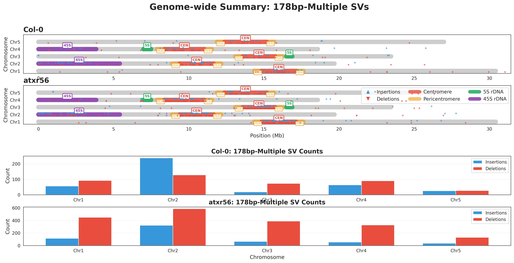

# SV Satellite Analyzer

[](https://opensource.org/licenses/MIT)
[](https://www.python.org/downloads/)
[](https://github.com/jacgonisa/sv-satellite-analyzer)

**A comprehensive pipeline for analyzing structural variations in satellite repeats from long-read sequencing data**

Developed for analyzing centromeric satellite repeat dynamics in *Arabidopsis thaliana*, but generalizable to any organism with tandem repeats.

## Example Output

<p align="center">
  
  <br>
  <em>Genome-wide distribution of 178bp-multiple SVs in Arabidopsis Col-0 vs atxr56 mutant</em>
</p>

## Overview

This pipeline identifies, quantifies, and visualizes structural variations (insertions and deletions) in satellite repeat arrays, with special focus on:
- Exact satellite unit multiples (e.g., 178bp centromeric repeats)
- Regional enrichment (centromeres, pericentromeres, rDNA loci)
- Single-molecule resolution SV tracking
- Genome-wide distribution patterns
- Mb-normalized comparisons

## Features

- **Memory-efficient**: Processes large BAM files without overwhelming system resources
- **Modular**: Each script performs a specific task and can be run independently
- **Flexible**: Configurable repeat sizes, genomic regions, and filtering thresholds
- **Comprehensive visualization**: Generates publication-ready plots including:
  - Genome-wide ideograms with annotated features
  - Density heatmaps
  - Size distribution histograms
  - Fold-change comparisons
  - Single-molecule SV positions

## Included Annotations

**TAIR12 (*Arabidopsis thaliana*) genome annotations are included** in `annotations/TAIR12/`:

- **Centromeres** - 178bp satellite repeat arrays for all 5 chromosomes
- **Pericentromeres** - Flanking regions adjacent to centromeres
- **5S rDNA** - 5S ribosomal DNA arrays (Chr3, Chr4)
- **45S rDNA** - Nucleolar Organizing Regions/NORs (Chr2, Chr4)
- **Chromosome sizes** - Complete chromosome length information
- **ID mapping** - RefSeq accession ↔ Chr name conversion

See `annotations/TAIR12/README.md` for detailed coordinate information and sources.

**For other organisms**: Use the same directory structure and BED format. See configuration section below.

## Requirements

### Software
- Python 3.7+
- pysam
- pandas
- numpy
- matplotlib
- seaborn
- samtools (for preprocessing)
- seqtk (optional, for downsampling)

### Input Data
- Mapped long-read sequencing data (BAM files, indexed)
- Reference genome coordinates (chromosome lengths)
- Genomic feature annotations (centromeres, pericentromeres, rDNA regions)

## Quick Start

```bash
# 1. Clone the repository
git clone https://github.com/jacgonisa/sv-satellite-analyzer.git
cd sv-satellite-analyzer

# 2. Install dependencies
conda env create -f environment.yml
conda activate sv_satellite

# 3. Configure your analysis
cp config/config_template.yaml config/my_analysis.yaml
# Edit config/my_analysis.yaml with your paths and parameters

# 4. Run SV detection
python scripts/sv_detection/detect_sv_molecules.py \
    --bam /path/to/sample.bam \
    --output results/sv_molecules \
    --sample sample_name \
    --config config/my_analysis.yaml

# 5. Generate visualizations
python scripts/visualization/plot_genome_wide_ideogram.py \
    --sv-catalog results/sv_molecules/sample_name_sv_catalog.tsv \
    --config config/my_analysis.yaml \
    --output results/plots
```

## Pipeline Structure

### 1. Preprocessing (Optional)
- **downsample_fastq.sh**: Downsample FASTQ files to equalize coverage between samples

### 2. SV Detection
- **detect_sv_molecules.py**: Extract SVs from BAM files with genomic and read-level positions
  - Outputs: SV catalogs, molecule summaries, 178bp-multiple lists
  - Tracks position on both genome and individual reads
- **create_rdna_beds.py**: Generate BED files for rDNA regions from GFF annotations

### 3. Analysis & Normalization
- **normalize_by_mapped_bases.py**: Calculate SVs per Mb for fair cross-sample comparison
  - **IMPORTANT**: Accounts for read length (N50) differences
  - Run AFTER SV detection on all samples
  - See `docs/normalization_guide.md` for detailed usage
  - Outputs: Normalized rates table, comparison plots

### 4. Visualization
- **plot_genome_wide_ideogram.py**: Create comprehensive genome-wide summary plots
  - Shows all chromosomes with annotated genomic features
  - Displays SV positions across the genome
  - Can annotate with normalized per-Mb rates

## Configuration

All analyses are controlled via YAML configuration files in `config/`:

```yaml
# Genome configuration
genome:
  name: "TAIR12"
  chromosomes: ["Chr1", "Chr2", "Chr3", "Chr4", "Chr5"]
  lengths:
    Chr1: 30427671
    Chr2: 19698289
    # ...

# Centromere coordinates
centromeres:
  Chr1: [14853761, 17129892]
  Chr2: [9388656, 11655818]
  # ...

# Analysis parameters
analysis:
  min_sv_size: 50  # Minimum SV size in bp
  satellite_repeat_size: 178  # Centromeric repeat unit size
  pericentromere_extension: 500000  # bp flanking centromere
  window_size: 500000  # For density calculations

# Paths
paths:
  rdna_5s: "/path/to/5s_rdna_regions.bed"
  rdna_45s: "/path/to/45s_rdna_regions.bed"
```

## Output Files

### SV Catalogs
- `{sample}_sv_catalog.tsv`: Per-SV details with genomic and read positions
- `{sample}_sv_molecules.tsv`: Per-molecule summary with all SVs
- `{sample}_insertions_178bp_multiples.tsv`: Satellite-unit multiple insertions
- `{sample}_deletions_178bp_multiples.tsv`: Satellite-unit multiple deletions

### Statistics
- `{sample}_sv_molecule_stats.tsv`: Summary statistics per region
- `178bp_multiples_comparison.tsv`: Cross-sample comparison table
- `mapped_bases_per_region.tsv`: Normalization factors

### Visualizations
- `genome_wide_ideogram_summary.png`: Comprehensive genome overview
- `genome_wide_density_heatmap.png`: Regional density tracks
- `genome_wide_fold_change.png`: Sample comparison in sliding windows
- `178bp_multiples_comparison_normalized.png`: Mb-normalized comparisons
- `insertions_vs_deletions_comparison.png`: INS vs DEL analysis

## Complete Workflow

### Basic Analysis (Single Sample)
```bash
# 1. Detect SVs
bash run_pipeline.sh -b sample.bam -s MySample -o results -c config.yaml

# That's it! You get: SV catalogs, molecule summaries, ideogram plot
```

### Comparative Analysis (Multiple Samples)
```bash
# 1. Detect SVs in each sample
bash run_pipeline.sh -b sample1.bam -s Sample1 -o results -c config.yaml
bash run_pipeline.sh -b sample2.bam -s Sample2 -o results -c config.yaml

# 2. Normalize by mapped bases (IMPORTANT for fair comparison!)
python scripts/analysis/normalize_by_mapped_bases.py \
    sample1.bam results/sv_molecules Sample1 \
    sample2.bam results/sv_molecules Sample2 \
    results/normalized

# 3. Generate comparison plot
python scripts/visualization/plot_genome_wide_ideogram.py \
    --sv-catalogs results/sv_molecules/Sample1_sv_catalog.tsv \
                  results/sv_molecules/Sample2_sv_catalog.tsv \
    --sample-names "Sample 1" "Sample 2" \
    --config config.yaml \
    --output results/plots/comparison.png
```

**See `docs/normalization_guide.md` for detailed normalization instructions.**

## Example Analysis

See `docs/example_workflow.md` for a complete walkthrough analyzing centromeric repeat dynamics in *Arabidopsis* ATXR5/6 mutants.

## Citation

If you use this pipeline in your research, please cite:

```
[Your paper citation here]
```

## Contributing

Contributions are welcome! Please:
1. Fork the repository
2. Create a feature branch
3. Submit a pull request with clear description

## License

MIT License - see LICENSE file for details

## Contact

- Issues: https://github.com/jacgonisa/sv-satellite-analyzer/issues
- GitHub: [@jacgonisa](https://github.com/jacgonisa)

## Acknowledgments

Developed for analyzing centromeric satellite repeat dynamics in *Arabidopsis thaliana* ATXR5/6 mutants using PacBio/ONT long-read sequencing data.
